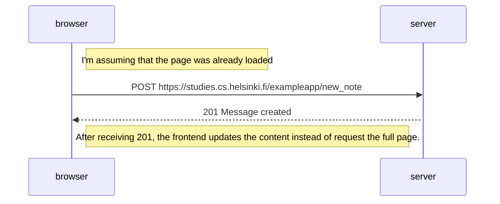

```mermaid
sequenceDiagram
  participant browser
  participant server

  Note right of browser: I'm assuming that the page was already loaded

  browser->>server: POST https://studies.cs.helsinki.fi/exampleapp/new_note
  activate server
  server-->>browser: 201 Message created

  Note right of browser: After receiving 201, the frontend updates the content instead of request the full page.


```
